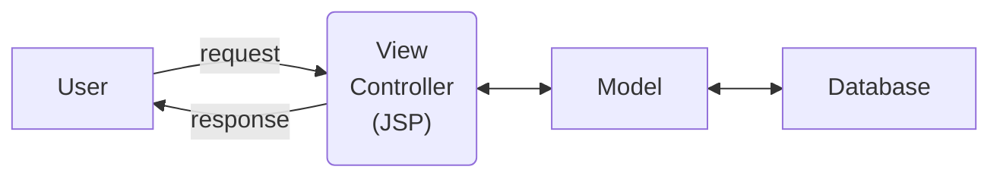
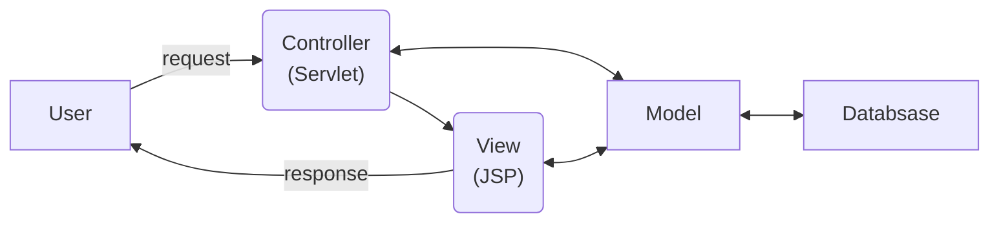
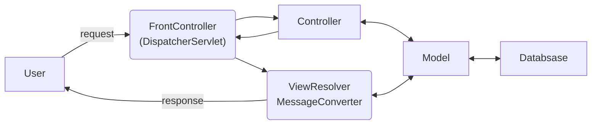
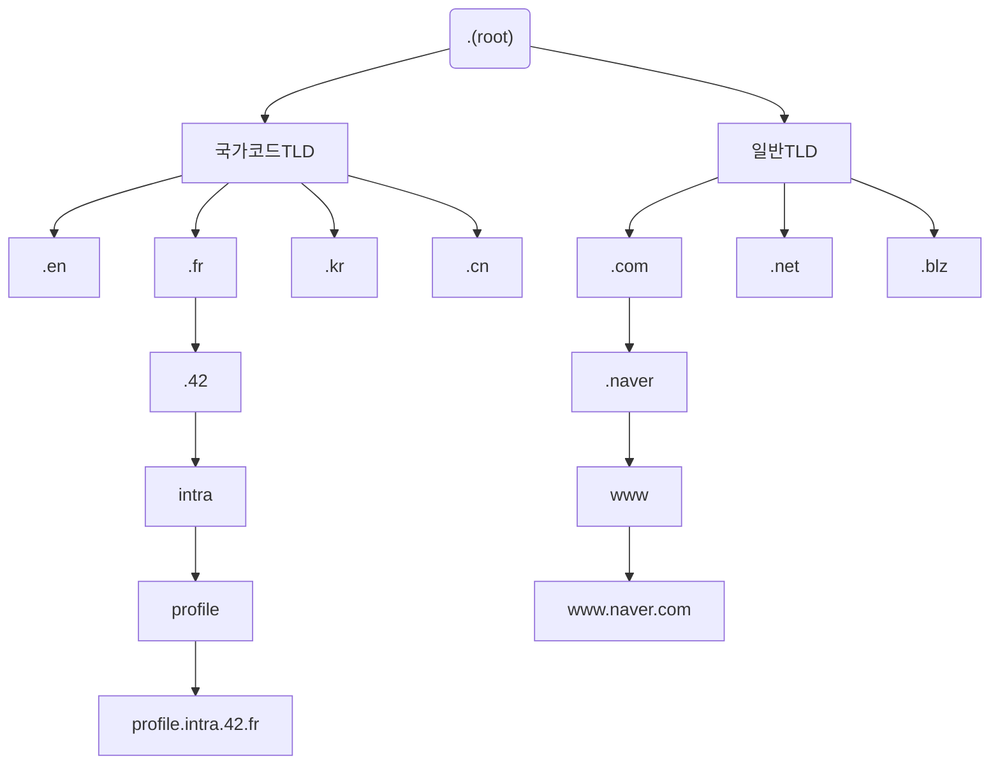

## 1일차

- [1일차](#1일차)
  - [TODO](#todo)
  - [IntelliJ, DataGrip, Redis 설치](#intellij-datagrip-redis-설치)
    - [IntelliJ, DataGrip](#intellij-datagrip)
    - [Redis](#redis)
  - [HTTP Status Code](#http-status-code)
    - [1XX - Informational](#1xx---informational)
    - [2XX - Success](#2xx---success)
    - [3XX - Redirection](#3xx---redirection)
    - [4XX - Client Error](#4xx---client-error)
    - [5XX - Server Error](#5xx---server-error)
  - [HTTP Header](#http-header)
  - [Chrome 개발자 도구](#chrome-개발자-도구)
  - [REST API](#rest-api)
  - [쿠키/세션, JWT](#쿠키세션-jwt)
    - [인증/인가](#인증인가)
    - [패러다임 충돌](#패러다임-충돌)
    - [쿠키/세션](#쿠키세션)
    - [JWT](#jwt)
  - [MVC, MVC2](#mvc-mvc2)
    - [MVC1](#mvc1)
    - [MVC2](#mvc2)
    - [Spring MVC](#spring-mvc)
  - [인프라 (HTTPS, DNS, CI/CD)](#인프라-https-dns-cicd)
    - [HTTPS](#https)
    - [DNS](#dns)
    - [CI/CD](#cicd)
  - [Git 컨벤션](#git-컨벤션)

### TODO

- [x] IntelliJ Community 버전에서 Ultimate 버전 업그레이드 하기
- [x] DataGrip 설치 https://luminitworld.tistory.com/82
- [x] redis 설치
- [x] HTTP Status Code
- [x] HTTP Header
- [x] 크롬 개발자도구
- [x] REST API 란 무엇인가?
- [x] 쿠키와 세션, JWT토큰
- [x] MVC, MVC2
- [x] 인프라 (HTTPS, DNS 서버, CI/CD)
- [x] Git 컨벤션

### IntelliJ, DataGrip, Redis 설치

#### IntelliJ, DataGrip

> [IntelliJ IDEA](https://www.jetbrains.com/ko-kr/idea/download/)  
> [DataGrip](https://www.jetbrains.com/ko-kr/datagrip/download/)

설치 가이드에 따라 설치한다.

#### Redis

> [Install Redis](https://redis.io/docs/latest/operate/oss_and_stack/install/install-redis/)    
> [Spring Data Redis 3.3.0](https://spring.io/projects/spring-data-redis)  
> [Spring Data Redis 3.3.0 API](https://docs.spring.io/spring-data/redis/docs/current/api/)  
> [Jedis 보다 Lettuce 를 쓰자](https://jojoldu.tistory.com/418)  
> [Lettuce Reference Guide](https://lettuce.io/core/release/reference/)  

Redis 설치는 [가이드 문서](https://redis.io/docs/latest/operate/oss_and_stack/install/install-redis/)를 참고하여 환경에 맞게 간단하게 설치할 수 있다.

Redis의 기본 포트는 6379이며, 설치 후 `redis-cli` 명령어를 통해 Redis 서버에 접속할 수 있다.

Spring Boot에서 지원하는 Redis Client는 `Jedis`와 `Lettuce`가 있으며, 최근에는 `Lettuce`를 사용하는 것이 권장되고 있다. [참고](https://jojoldu.tistory.com/418)

`spring-boot-starter-data-redis` 의존성 추가시 `Lettuce`를 사용하도록 설정되어 있으며, `application.properties` 파일에 다음과 같이 설정할 수 있다.

```groovy
// build.gradle
implementation 'org.springframework.boot:spring-boot-starter-data-redis'    // Default Lettuce
```

```groovy
// build.gradle
implementation 'redis.clients:jedis:3.9.0' // Use Jedis
implementation ('org.springframework.boot:spring-boot-starter-data-redis') {
        exclude group: 'io.lettuce', module: 'lettuce-core' // Exclude Lettuce 
}
```

```properties
# application.properties
spring.redis.host=localhost
spring.redis.port=6379
```

### HTTP Status Code

> [Hypertext Transfer Protocol (HTTP) Status Code Registry](https://www.iana.org/assignments/http-status-codes/http-status-codes.xhtml)  
> [RFC 2616 - Section 10](https://datatracker.ietf.org/doc/html/rfc2616#section-10)  
> [MDN - HTTP Status Code](https://developer.mozilla.org/ko/docs/Web/HTTP/Status)  
> [혼공 - HTTP 상태코드 100~500 전체 요약](https://hongong.hanbit.co.kr/http-%EC%83%81%ED%83%9C-%EC%BD%94%EB%93%9C-%ED%91%9C-1xx-5xx-%EC%A0%84%EC%B2%B4-%EC%9A%94%EC%95%BD-%EC%A0%95%EB%A6%AC/)

HTTP 상태 코드는 클라이언트에서 서버에서 처리된 결과를 나타내는 세 자리 숫자로 이루어진 코드입니다.
첫 번째 숫자는 응답의 종류를 구분하고, 나머지 두 숫자는 세부적인 응답 내용을 구분합니다.

* **1XX**: Informational(정보 제공)
    * 임시 응답으로 현재 클라이언트의 요청까지는 처리되었으니 계속 진행하라는 의미입니다. HTTP 1.1 버전부터 추가되었습니다.
* **2XX**: Success(성공)
    * 클라이언트의 요청이 서버에서 성공적으로 처리되었다는 의미입니다.
* **3XX**: Redirection(리다이렉션)
    * 완전한 처리를 위해서 추가 동작이 필요한 경우입니다. 주로 서버의 주소 또는 요청한 URI의 웹 문서가 이동되었으니 그 주소로 다시 시도하라는 의미입니다.
* **4XX**: Client Error(클라이언트 에러)
    * 없는 페이지를 요청하는 등 클라이언트의 요청 메시지 내용이 잘못된 경우를 의미합니다.
* **5XX**: Server Error(서버 에러)
    * 서버 사정으로 메시지 처리에 문제가 발생한 경우입니다. 서버의 부하, DB 처리 과정 오류, 서버에서 익셉션이 발생하는 경우를 의미합니다.

HTTP 상태 코드는 IANA(Internet Assigned Numbers Authority)에서 `HTTP Status Code Registry`라는 이름으로 관리하고 있습니다.
자세한 내용은 [여기](https://www.iana.org/assignments/http-status-codes/http-status-codes.xhtml)에서 확인할 수 있습니다.

#### 1XX - Informational

| Status Code | Status Message      | Description                                                   |
|:-----------:|---------------------|---------------------------------------------------------------|
|     100     | Continue            | 서버가 요청을 받았으며 클라이언트는 요청을 계속해도 된다는 것을 의미합니다.                    |
|     101     | Switching Protocols | 서버가 업그레이드(HTTP/1.1 -> HTTP/2.0)를 위해 프로토콜을 변경하고 있다는 의미입니다.     |
|     102     | Processing          | 서버가 처리하는 데 오랜 시간이 예상되어 클라이언트에서 타임 아웃이 발생하지 않도록 이 응답 코드를 보냅니다. 

* Rest of 1XX status code are unassigned

#### 2XX - Success

| Status Code | Status Message                | Description                               |
|:-----------:|-------------------------------|-------------------------------------------|
|     200     | OK                            | 요청이 성공적으로 처리되었습니다.                        |
|     201     | Created                       | 요청이 성공적으로 처리되었으며 새로운 리소스가 생성되었습니다.        |
|     202     | Accepted                      | 요청이 수신되었지만 처리되지 않았습니다.                    |
|     203     | Non-Authoritative Information | 요청이 성공적으로 처리되었지만 응답은 프록시 서버에서 제공되었습니다.    |
|     204     | No Content                    | 요청이 성공적으로 처리되었지만 응답 본문에 정보가 없습니다.         |
|     205     | Reset Content                 | 요청이 성공적으로 처리되었지만 클라이언트는 문서 뷰를 리셋해야 합니다.   |
|     206     | Partial Content               | 요청이 성공적으로 처리되었지만 응답은 범위 응답입니다.            |
|     207     | Multi-Status                  | 요청이 성공적으로 처리되었지만 응답은 여러 상태 코드로 구성되어 있습니다. |
|     208     | Already Reported              | 요청이 성공적으로 처리되었지만 응답은 멀티 상태 응답입니다.         |

* Rest of 2XX status code are unassigned

#### 3XX - Redirection

| Status Code | Status Message     | Description                      |
|:-----------:|--------------------|----------------------------------|
|     300     | Multiple Choices   | 요청한 리소스에 여러 선택지가 있습니다.           |
|     301     | Moved Permanently  | 요청한 리소스가 새로운 URL로 영구적으로 이동되었습니다. |
|     302     | Found              | 요청한 리소스가 일시적으로 다른 URL로 이동되었습니다.  |
|     303     | See Other          | 요청한 리소스가 다른 URL로 이동되었습니다.        |
|     304     | Not Modified       | 요청한 리소스가 마지막 요청 이후 변경되지 않았습니다.   |
|     305     | Use Proxy          | 요청한 리소스에 대한 액세스는 프록시로만 가능합니다.    |
|     306     | (Unused)           | 이 상태 코드는 더 이상 사용되지 않습니다.         |
|     307     | Temporary Redirect | 요청한 리소스가 일시적으로 다른 URL로 이동되었습니다.  |

* Rest of 3XX status code are unassigned

#### 4XX - Client Error

| Status Code | Status Message                     | Description                               |
|:-----------:|------------------------------------|-------------------------------------------|
|     400     | Bad Request                        | 클라이언트의 요청이 잘못되었습니다.                       |
|     401     | Unauthorized                       | 클라이언트가 인증되지 않았습니다.                        |
|     402     | Payment Required                   | 요청한 리소스에 대한 결제가 필요합니다.                    |
|     403     | Forbidden                          | 클라이언트가 리소스에 액세스할 권한이 없습니다.                |
|     404     | Not Found                          | 요청한 리소스를 찾을 수 없습니다.                       |
|     405     | Method Not Allowed                 | 요청한 리소스에서 지원하지 않는 HTTP 메서드입니다.            |
|     406     | Not Acceptable                     | 요청한 리소스에서 지원하지 않는 요청 헤더입니다.               |
|     407     | Proxy Authentication Required      | 프록시 서버에서 인증이 필요합니다.                       |
|     408     | Request Timeout                    | 클라이언트의 요청 시간이 초과되었습니다.                    |
|     409     | Conflict                           | 클라이언트의 요청이 서버의 현재 상태와 충돌합니다.              |
|     410     | Gone                               | 요청한 리소스가 더 이상 서버에 없습니다.                   |
|     411     | Length Required                    | Content-Length 헤더가 누락되었습니다.               |
|     412     | Precondition Failed                | 클라이언트의 요청 전제 조건이 실패했습니다.                  |
|     413     | Payload Too Large                  | 클라이언트의 요청이 너무 큽니다.                        |
|     414     | URI Too Long                       | URI가 너무 깁니다.                              |
|     415     | Unsupported Media Type             | 요청한 리소스에서 지원하지 않는 미디어 타입입니다.              |
|     416     | Range Not Satisfiable              | 클라이언트가 지정한 리소스의 범위가 서버의 리소스 사이즈와 맞지 않습니다. |
|     417     | Expectation Failed                 | 클라이언트가 지정한 Expect 헤더를 서버가 이해할 수 없습니다.     |
|     422     | Unprocessable Entity               | 클라이언트가 송신한 XML이 구문은 맞지만, 의미상 오류가 있습니다.    |
|     423     | Locked                             | 리소스가 잠겨 있어서 요청을 수행할 수 없습니다.               |
|     424     | Failed Dependency                  | 이전 요청의 실패로 인해 요청이 실패했습니다.                 |
|     426     | Upgrade Required                   | 클라이언트가 요청한 리소스를 얻기 위해서는 업그레이드가 필요합니다.     |
|     428     | Precondition Required              | 요청이 조건부이지만 조건이 충족되지 않았습니다.                |
|     429     | Too Many Requests                  | 클라이언트가 일정 시간 동안 너무 많은 요청을 보냈습니다.          |
|     431     | Request Header Fields Too Large    | 클라이언트가 보낸 헤더 필드가 너무 큽니다.                  |
|     444     | Connection Closed Without Response | 클라이언트가 요청을 보내고 서버가 연결을 끊었습니다.(NGINX)      |
|     451     | Unavailable For Legal Reasons      | 요청한 리소스가 법적인 이유로 이용할 수 없습니다.              |

* Rest of 4XX status code are unassigned

#### 5XX - Server Error

| Status Code | Status Message             | Description                                |
|:-----------:|----------------------------|--------------------------------------------|
|     500     | Internal Server Error      | 서버에 오류가 발생했습니다.                            |
|     501     | Not Implemented            | 서버가 요청을 처리할 수 없습니다.                        |
|     502     | Bad Gateway                | 게이트웨이나 프록시 서버에서 응답을 받지 못했습니다.              |
|     503     | Service Unavailable        | 서버가 오버로드되었거나 유지보수 중입니다.                    |
|     504     | Gateway Timeout            | 게이트웨이나 프록시 서버에서 응답을 받지 못했습니다. 시간이 초과되었습니다. |
|     505     | HTTP Version Not Supported | 서버가 요청한 HTTP 버전을 지원하지 않습니다.                |
|     506     | Variant Also Negotiates    | 서버가 요청한 상태 헤더에 대한 선택지를 가지고 있습니다.           |
|     507     | Insufficient Storage       | 서버가 요청을 처리하기 위한 공간이 부족합니다.                 |

* Rest of 5XX status code are unassigned

### HTTP Header

> [Message Headers](https://www.iana.org/assignments/message-headers/message-headers.xhtml)  
> [RFC 4229](https://datatracker.ietf.org/doc/html/rfc4229), [RFC 6648](https://datatracker.ietf.org/doc/html/rfc6648)  
> [MDN - HTTP Header](https://developer.mozilla.org/ko/docs/Web/HTTP/Headers)  
> [토스페이먼츠 - HTTP 헤더](https://docs.tosspayments.com/resources/glossary/http-header)

HTTP 헤더는 클라이언트와 서버가 요청 또는 응답 메시지에 추가 정보를 전달하는 데 사용하는 `Key-Value` 형태의 메타데이터입니다.

HTTP 헤더는 표준 헤더와 사용자 정의 헤더로 나뉩니다. 표준 헤더는
[IANA(Internet Assigned Numbers Authority)](https://www.iana.org/assignments/message-headers/message-headers.xhtml)
에서 관리하고 있으며 [RFC 4229](https://datatracker.ietf.org/doc/html/rfc4229)에 정의되어 있습니다.

사용자 정의 헤더는 사용자가 임의로 정의한 헤더로, 표준 헤더와 구분하기 위해 `X-`로 시작하는 것이 관례였으나
비표준 필드가 표준이 되었을때 불편함을 유발하는 이유로 2012년 6월에 [RFC 6648](https://datatracker.ietf.org/doc/html/rfc6648)에서 폐기되었습니다

대표적인 표준 헤더는 다음과 같습니다.

* `Accept`: 클라이언트가 처리할 수 있는 미디어 타입을 서버에 알립니다.
* `Authorization`: 클라이언트가 서버에 접근할 때 사용하는 인증 정보를 포함합니다.
* `Content-Type`: 요청 또는 응답 메시지의 본문에 포함된 미디어 타입을 나타냅니다.
* `Cache-Control`: 캐시에 대한 동작을 지정합니다.
* `Last-Modified`: 리소스가 마지막으로 수정된 날짜를 나타냅니다.
* `Cross-Origin-Opener-Policy`: CORP 혹은 CORS로 명시적 권한 부여 없이 교차 출처 리소스를 가져올 수 있도록 한다.

### Chrome 개발자 도구

> [Chrome DevTools](https://developer.chrome.com/docs/devtools/)  
> [lemon Velog - 개발자 도구의 기능을 뜯어보자](https://velog.io/@remon/%EA%B0%9C%EB%B0%9C%EC%9E%90-%EB%8F%84%EA%B5%AC%EC%9D%98-%EA%B8%B0%EB%8A%A5%EC%9D%84-%EB%9C%AF%EC%96%B4%EB%B3%B4%EC%9E%90)

크롬 개발자 도구는 브라우저에서 제공하는 디버깅, 테스팅, 성능 측정 등의 기능을 제공하는 도구입니다.
크롬 개발자 도구는 크롬 브라우저에서 `F12` 키를 누르거나 `우측 상단 메뉴 > 도구 더보기 > 개발자 도구`를 클릭하여 열 수 있습니다.

크롬 개발자 도구는 다음과 같은 주요 탭으로 구성되어 있습니다.

* `Elements`: HTML, CSS를 수정하고 렌더링된 페이지의 DOM 구조를 확인할 수 있습니다.
* `Console`: JavaScript 콘솔을 통해 디버깅 메시지를 확인하고 JavaScript 코드를 실행할 수 있습니다.
* `Sources`: JavaScript 디버깅을 위한 스크립트 파일을 확인하고 디버깅할 수 있습니다.
* `Network`: 네트워크 요청을 확인하고 요청/응답 헤더, 본문, 타이밍 등을 확인할 수 있습니다.
* `Performance`: 페이지의 성능을 측정하고 분석할 수 있습니다.
* `Memory`: 페이지의 메모리 사용량을 확인하고 메모리 누수를 분석할 수 있습니다.
* `Application`: 쿠키, 로컬 스토리지, 세션 스토리지 등을 확인하고 관리할 수 있습니다.

> 상세 내용은 위 블로그를 참고하시기 바랍니다.

### REST API

> [Roy Thomas Fielding, "Architectural Styles and the Design of Network-based Software Architectures", 2000](https://ics.uci.edu/~fielding/pubs/dissertation/top.htm)  
> [IBM - REST API란 무엇인가요?](https://www.ibm.com/kr-ko/topics/rest-apis)  
> [RedHat - REST API란?](https://www.redhat.com/ko/topics/api/what-is-a-rest-api)  
> [NHN - REST API 제대로 알고 사용하기](https://meetup.nhncloud.com/posts/92)

REST API란 로이 필링이 자신의 논문에서 제시한 `REST 아키텍처 스타일`의 제약 조건을 준수하는 어플리케이션 프로그래밍 인터페이스(API)를 말합니다.
REST 아키텍처 스타일을 준수하면 서버와 클라이언트 간의 통신을 단순화하고, 서버의 부하를 줄이며, 서비스의 확장성을 향상시킬 수 있습니다.

REST API는 Resource, Verb, Representation의 세 가지 요소로 구성되어 있습니다.

* `Resource`: URI(Uniform Resource Identifier)로 표현되는 자원을 의미합니다.
* `Verb`: 자원에 대한 행위를 나타내는 HTTP 메서드(GET, POST, PUT, DELETE)를 의미합니다.
* `Representation`: 자원의 상태를 나타내는 데이터 형식(XML, JSON)을 의미합니다.

REST API 설계시 가장 중요한 원칙은 다음과 같습니다.

1. URI는 정보의 자원을 표현해야 한다. (리소스명은 동사보다는 명사를 사용)
2. 자원에 대한 행위는 HTTP Method(GET, POST, PUT, DELETE 등)로 표현한다.

그외에 REST API 설계시 주의 사항은 다음과 같습니다.

* 슬래시 구분자(/)는 계층 관계를 나타내는 데 사용한다.
* URI 마지막 문자로 슬래시(/)를 포함하지 않는다.
* 하이픈(-)은 URI 가독성을 높이는데 사용한다.
* 밑줄(_)은 URI에 사용하지 않는다.
* URI 경로에는 소문자를 사용한다.
* 파일 확장자는 URI에 포함시키지 않는다.

> 상세 내용은 위 링크를 참고하시기 바랍니다.

### 쿠키/세션, JWT

#### 인증/인가

- **인증(Authentication)**
  - 서비스에 등록된 클라이언트의 신원을 확인하는 것
  - 회원가입, 로그인 등
- **인가(Authorization)**
  - 인증된 클라이언트의 요청(request) 혹은 접근 권한을 확인하는 것
  - 블로그 포스팅, 댓글 작성 등, 로그인이 되어있는 상태에서 실행하는 기능.

클라이언트는 회원가입을 통해 서버에 자신의 정보를 등록하고 로그인을 하여 인증을 받습니다.
로그인된 클라이언트가 서버에서 제공하는 기능들을 사용하기 위해서는 인가를 받아야합니다.

예를 들어 게시판에 글을 작성한다고 했을 때, 오직 인가된 사용자만 글을 작성하고 수정해야 합니다.
인가되지 않은 사용자가 글을 작성하거나, 본인의 게시물을 다른 사용자가 수정한다면 큰 혼란이 발생할 수 있습니다.

#### 패러다임 충돌

HTTP는 비연결성(connectionless)과 무상태성(stateless)이라는 특징을 갖고 있습니다.
즉, 서버는 클라이언트에 대한 정보와 상태를 유지하지 않습니다.

하지만 로그인과 같은 기능을 구현하기 위해서는 서버가 클라이언트의 정보와 상태를 유지(Stateful)해야한다.
이러한 패러다임의 충돌을 해소하는 방법으로 `쿠키/세션`, `JWT(JSON Web Token)` 등이 있습니다.

#### 쿠키/세션

> [MDN - HTTP 쿠키](https://developer.mozilla.org/ko/docs/Web/HTTP/Cookies)  
> [MDN - HTTP 세션](https://developer.mozilla.org/ko/docs/Web/HTTP/Session)

쿠키란 서버가 클라이언트의 웹 브라우저에 전송하는 작은 데이터 조각입니다.
클라이언트는 이를 브라우저의 쿠키 저장소에 저장하고, 동일한 서버에 재요청시 요청 헤더에 쿠키를 포함시켜 전송합니다.

HTTP서버는 무상태성(stateless)이기 때문에 클라이언트의 상태를 유지하지 않지만,
모든 요청에 쿠키를 포함하여 로그인인 된 클라이언트라는 상태를 전송하여 문제를 해결합니다.

쿠키는 이름, 값, 그리고 0개 이상의 속성으로 구성되고, 쿠키의 속성에는 생명주기, 도메인, 경로, 보안플래그 등이 있습니다.

- **이름, 값** : `<cookie-name>=<cookie-value>`
- **속성 :**
  - 생명주기(`expires=Sat, 26-Dec-2020 05:23:12 GMT`, `max-age=1800`)
    - 생략시 브라우저 종료시 까지 유지, 입력시 해당 기간까지 유지
    - `expires` → 만료일 되면 쿠키 삭제, `max-age` → 0이나 음수이면 쿠키 삭제
  - 도메인(`domain=example.org`)
    - 명시한 문서 기준 도메인(example.org)과 서브도메인(dev.example.org 등)에서 쿠키 생성
    - 생략시 현재 문서 기준 도메인(example.org)에서만 쿠키 생성, 서브도메인에서는 쿠키 미포함
  - 경로(`path=/`)
    - 명시한 경로를 포함한 하위 경로 페이지에서만 쿠키 접근, 일반적으로 루트(`/`)로 지정
  - 보안(`Secure`, `HttpOnly`, `Samesite`)
    - Secure: 쿠키는 http, https 구분하지 않고 전송하지만, Secure적용시 https인 경우에만 전송
    - HttpOnly: [XSS(Cross-site Scripting)](https://ko.wikipedia.org/wiki/%EC%82%AC%EC%9D%B4%ED%8A%B8_%EA%B0%84_%EC%8A%A4%ED%81%AC%EB%A6%BD%ED%8C%85) 공격 방지를 위해 자바스크립트에서 쿠키 접근(`document.cookie`)을 제한하며, 오직 HTTP 전송에서만 쿠키를 사용한다.
    - Samesite: [XSRF(Cross-site Request Forgery)](https://ko.wikipedia.org/wiki/%EC%82%AC%EC%9D%B4%ED%8A%B8_%EA%B0%84_%EC%9A%94%EC%B2%AD_%EC%9C%84%EC%A1%B0) 공격을 방지를 위해 요청 도메인과 쿠키에 설정된 도메인이 같은 경우에만 쿠키를 전송한다.

세션(Session)은 서버에서 클라이언트의 상태를 임시로 저장하는 저장 공간입니다.
쿠키는 임의로 조작이 가능하고, 보안에 취약하다는 단점이 있기 때문에 DB를 사용하는 것이 아니라
세션이라는 임시 저장소를 사용하여 보안을 강화합니다.

* 로그인 요청


* 로그인 상태 유지
  

예를들어 서버에서는 해석불가능한 임의의 값 혹은 토큰(sessionId)을 생성 및 관리하여 쿠키에 저장하고,
서버에서 토큰(sessionId)과 사용자(memberId)를 매핑하여 사용자를 식별하고 인증합니다.
또한 토큰의 만료시간을 짧게(예: 30분) 유지하고, 해킹이 의심되는 경우(예: 해외 IP에서 요청 등) 토큰을 강제로 제거하여 보안을 강화할 수 있습니다.

#### JWT

> [JWT.IO](https://jwt.io/)  
> [RFC 7519](https://datatracker.ietf.org/doc/html/rfc7519)  
> [Refresh Token Rotation 과 Redis로 토큰 탈취 시나리오 대응](https://junior-datalist.tistory.com/352)  

JWT는 JSON Web Token의 약자로, JSON 객체를 사용하여 정보를 안전하게 전달하는 토큰 기반 인증 방식입니다.
JSON Web Token은 클레임 기반으로 작동하며, 클레임은 토큰에서 사용할 정보의 조각들을 의미합니다.

JWT는 Header, Payload, Signature 세 부분으로 구성되어 있습니다.

* `Header`: 토큰의 타입과 해싱 알고리즘을 포함합니다.
* `Payload`: 클레임(claim) 정보를 포함합니다. 클레임은 토큰에 담을 정보를 의미하며, 등록된 클레임, 공개 클레임, 비공개 클레임으로 나뉩니다.
  * ‼ 토큰이 탈취되면 payload에 저장된 정보가 노출되기 때문에, 민감한 정보는 payload에 저장하지 않는 것이 좋습니다.
* `Signature`: Header와 Payload를 Base64로 인코딩한 후, 비밀키를 사용하여 서명한 값입니다.

JWT는 서버에서 암호화된 토큰을 클라이언트에게 전달하고, 클라이언트는 토큰을 서버에 전달하여 인증을 수행합니다.
JWT는 서버에서 클라이언트의 상태를 유지하지 않기 때문에,
HTTP와 같이 무상태성을 유지할 수 있고 서버의 부하를 줄이고 확장성을 향상시킬 수 있습니다.

하지만 JWT는 토큰이 클라이언트에 저장되기 때문에, 토큰이 탈취되면 클라이언트의 정보가 노출될 수 있습니다.
따라서 JWT를 사용할 때는 토큰의 만료시간을 짧게 유지하고, HTTPS를 사용하여 통신하는 것이 좋습니다.

JWT를 활용하여 인증/인가 기능을 구현할 때는 보통
AccessToken과 RefreshToken을 사용하여 AccessToken의 만료시간을 짧게 유지하고,
RefreshToken을 사용하여 AccessToken을 갱신하는 방식을 사용할 수 있습니다.

추가적으로 RefreshToken을 사용할 때는 RefreshToken Rotation이나
Redis와 같은 저장소를 사용하여 토큰 탈취 시나리오에 대응할 수 있습니다.

### MVC, MVC2

> [Spring Docs - Web MVC framework](https://docs.spring.io/spring-framework/docs/3.2.x/spring-framework-reference/html/mvc.html)    
> [뉴렉처 - 서블릿/JSP 강의 46 - JSP MVC model1을 model2 방식으로](https://www.youtube.com/watch?v=tPEf5VLKJI0)  

MVC 패턴은 Model, View, Controller의 약자로 소프트웨어 디자인 패턴 중 하나입니다.
MVC 패턴은 사용자 인터페이스를 세 가지 역할로 구분하여 개발하는 패턴으로, 각 역할은 다음과 같습니다.

* `Model`: 데이터와 비즈니스 로직을 담당하는 역할입니다.
* `View`: 사용자 인터페이스를 담당하는 역할입니다.
* `Controller`: 사용자 입력을 받아 Model과 View를 연결하는 역할입니다.

#### MVC1

`MVC1` 패턴은 JSP에서 Model, View, Controller 역할을 모두 수행하는 패턴입니다.



#### MVC2

`MVC2` 패턴은 JSP 페이지에서 View 역할만 수행하고, Controller 역할을 Servlet이 담당하는 패턴입니다.
JSP와 서블릿을 분리하면 SRP(Single Responsibility Principle)를 준수할 수 있고, 유지보수가 용이해집니다.



#### Spring MVC

`Spring MVC`는 MVC2 패턴을 기반으로 FrontController 패턴을 적용했습니다.
Spring MVC의 DispatcherServlet은 모든 요청을 받아서 적절한 Controller에 요청을 전달하고,
ViewResolver 혹은 MessageConverter를 통해 응답을 생성합니다.



### 인프라 (HTTPS, DNS, CI/CD)

#### HTTPS

> [SSL - HTTPS란 무엇입니까?](https://www.ssl.com/ko/%EC%9E%90%EC%A3%BC-%EB%AC%BB%EB%8A%94-%EC%A7%88%EB%AC%B8/https-%EB%9E%80/)  
> [SSL - SSL이란 무엇입니까?](https://www.ssl.com/ko/%EC%9E%90%EC%A3%BC-%EB%AC%BB%EB%8A%94-%EC%A7%88%EB%AC%B8/%EC%9E%90%EC%A3%BC-%EB%AC%BB%EB%8A%94-%EC%A7%88%EB%AC%B8-SSL-%EB%AC%B4%EC%97%87%EC%9E%85%EB%8B%88%EA%B9%8C/)  
> [AWS - HTTP와 HTTPS의 차이점은 무엇인가요?](https://aws.amazon.com/ko/compare/the-difference-between-https-and-http/)

HTTPS(HyperText Transfer Protocol Secure)는 HTTP 프로토콜의 보안 버전으로, 데이터를 암호화하여 안전하게 전송하는 프로토콜입니다.
HTTPS는 SSL(Secure Sockets Layer) 또는 TLS(Transport Layer Security) 프로토콜을 사용하여 데이터를 암호화하고 인증합니다.

SSL/TLS는 HTTP와 TCP 사이에 위치한 보안 프로토콜입니다. TLS는 SSL의 후속 버전으로, SSL 3.0 버전 이후부터 TLS로 명칭되었습니다.

SSL/TLS는 `공개키 암호화 방식`을 사용하여 데이터를 암호화하고, `디지털 인증서`를 사용하여 서버의 신원을 인증합니다.

클라이언트는 `CA(Certificate Authority)`로부터 발급받은 서버의 공개키를 사용하여 데이터를 암호화하고,
서버는 개인키를 사용하여 데이터를 복호화합니다.

CA는 클라이언트와 서버 간의 통신을 보증하는 신뢰할 수 있는 제3자 기관입니다.
서버에서 CA에 자신의 신원을 제출하면, CA가 이를 검증하고 자신의 디지털 서명이 들어간,
즉 CA의 개인키로 암호화된 인증서를 발급합니다.
서버는 발급받은 인증서를 클라이언트에게 전달하고,
클라이언트는 CA의 공개키를 사용하여 인증서를 복호화하여 서버의 신원을 확인합니다.

#### DNS

DNS는 Domain Name System의 약자로, 도메인 이름을 IP 주소로 변환하는 시스템입니다.

인터넷에서는 컴퓨터가 서로 통신할 때 IP 주소를 사용하지만, 숫자로된 IP 주소는 사람이 기억하기 어렵기 때문에
DNS는 사람이 기억하기 쉬운 도메인 이름을 IP 주소로 변환하는 역할을 합니다.

도메인 이름은 계층적인 구조로 되어 있으며, `.`을 구분자로 사용하고
최상위 도메인(TLD, Top-Level Domain)부터 하위 도메인(Subdomain)까지 구성되어 있습니다.



#### CI/CD

CI(Continuous Integration)는 지속적 통합을 의미하며,
개발자들이 코드를 공유 저장소에 푸시할 때마다 자동으로 빌드 및 테스트를 수행하는 프로세스입니다.

CD(Continuous Deployment)는 지속적 배포를 의미하며,
코드 변경 사항이 테스트를 통과하면 자동으로 프로덕션 환경에 배포하는 프로세스입니다.

CI/CD를 구현하기 위해 `Github Actions`, `Jenkins`, `Travis CI`, `Circle CI` 등
다양한 CI/CD 도구를 활용할 수 있습니다.

### Git 컨벤션

> [Conventional Commits](https://www.conventionalcommits.org/ko/v1.0.0/)

Git 컨벤션은 Git 저장소에서 커밋 메시지를 작성할 때 일관성을 유지하기 위한 규칙입니다.

`Conventional Commits`은 커밋 메시지를 일관성 있게 작성하기 위한 규칙으로,
`type`, `scope`, `description`로 구성되어 있습니다.

```plaintext
<type>[optional scope]: <description>

[optional body]

[optional footer(s)]
```

* `type`: 커밋의 유형을 나타내는 필수 항목입니다.
  * `fix`, feat, docs, style, refactor, test, chore 등의 값을 사용할 수 있습니다. (자세한 내용은 [여기](https://www.conventionalcommits.org/ko/v1.0.0/#%EA%B7%9C%EA%B2%A9)를 참고
* `scope`는 커밋의 범위를 나타내는 옵션입니다.
* `description`은 커밋의 내용을 간략하게 요약한 내용입니다.

`Conventional Commits`의 예제는 다음과 같습니다.

```plaintext
feat: add new feature
```

```plaintext
fix(parser): fix bug
```

```plaintext
docs: update README.md
```

```plaintext
style(index): format code
```

> 상세 내용은 위 링크를 참고하시기 바랍니다.
