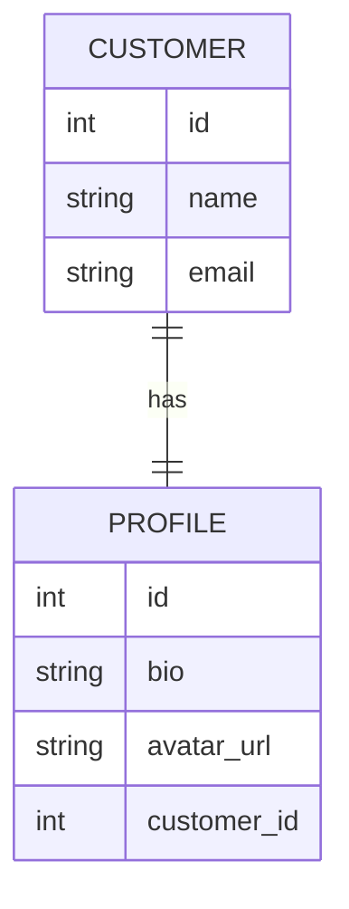
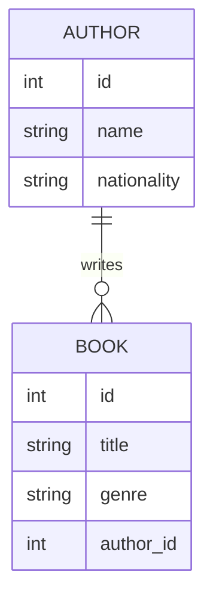
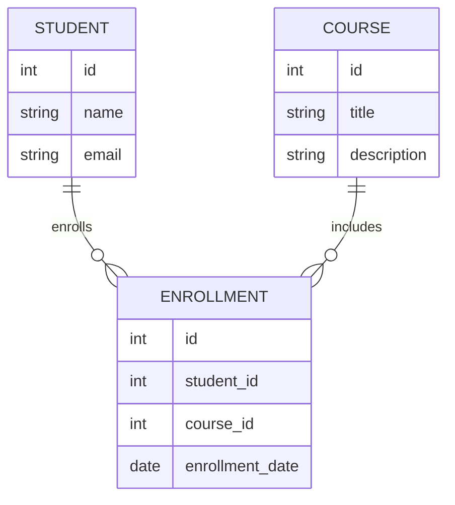
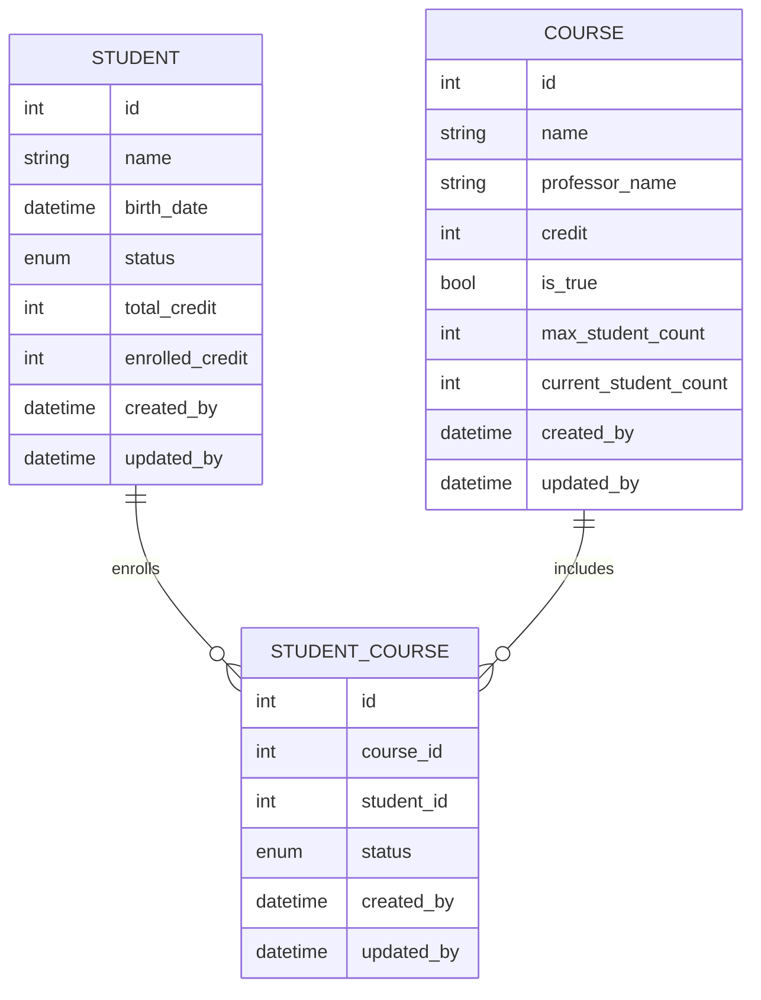

## 3일차

- [3일차](#3일차)
  - [TODO](#todo)
  - [@Embedded, @Embeddable](#embedded-embeddable)
  - [연관관계 설정](#연관관계-설정)
    - [@OneToOne, @ManyToOne, @OneToMany, @ManyToMany](#onetoone-manytoone-onetomany-manytomany)
    - [@ManyToMany의 단점과 중간 테이블](#manytomany의-단점과-중간-테이블)
    - [기본키(PK), 왜래키(FK), 연관관계의 주인](#기본키pk-왜래키fk-연관관계의-주인)
  - [ERD 작성](#erd-작성)

### TODO

- [x] @Embedded, @Embeddable
- [x] 연관 관계 설정
    - [x] @OneToOne, @ManyToOne, @ManyToMany, @OneToMany
    - [x] @ManyToMany의 단점
    - [x] 중간 테이블
    - [x] PK, FK
    - [x] 연관관계의 주인
- [x] ERD 작성

### @Embedded, @Embeddable

> [JavaEE 7 - Embedded](https://docs.oracle.com/javaee%2F7%2Fapi%2F%2F/javax/persistence/Embedded.html)  
> [JavaEE 7 - Embeddable](https://docs.oracle.com/javaee%2F7%2Fapi%2F%2F/javax/persistence/Embeddable.html)  
> [JPA 사용시 @Embedded 주의사항](https://jojoldu.tistory.com/559)

임베디드 타입이란 새로운 값 타입을 정의하여 테이블의 컬럼처럼 사용할 수 있게 해주는 기능입니다.

* JPA에서 `@Embedded`와 `@Embeddable` 어노테이션을 사용하여 임베디드 타입을 사용할 수 있습니다.  
추가로 기본 생성자를 반드시 정의해야 합니다.

```java
@Embeddable
public class Address {
    private String city;

    private String street;

    private String zipcode;
}
```

```java
@Entity
public class Member {
    @Id
    private Long id;

    private String name;

    @Embedded
    private Address address;
}

```

* 한 엔티티에서 같은 임베디드 타입을 여러 번 사용하고 싶다면
`@AttributeOverrides`와 `@AttributeOverride`를 사용하여 컬럼명 속성을 재정의해야합니다.

```java
@Entity
public class Member {
    @Id
    private Long id;

    private String name;

    @Embedded
    @AttributeOverrides({
            @AttributeOverride(name = "city", column = @Column(name = "home_city")),
            @AttributeOverride(name = "street", column = @Column(name = "home_street")),
            @AttributeOverride(name = "zipCode", column = @Column(name = "home_zipCode"))
    })
    private Address home;

    @Embedded
    @AttributeOverrides({
            @AttributeOverride(name = "city", column = @Column(name = "company_city")),
            @AttributeOverride(name = "street", column = @Column(name = "company_street")),
            @AttributeOverride(name = "zipCode", column = @Column(name = "company_zipCode"))
    })
    private Address company;
}
```

* 만약 임베디드 타입의 값이 null인 경우 매핑한 컬럼 값은 모두 null이 됩니다.

```java
@Entity
public class Member {
    @Id
    private Long id;
    private String name;
    @Embedded
    private Address address;
}
```

```java
class Main {
    public static void main(String[] args) {
        Member member = new Member();
        member.setId(1L);
        member.setName("홍길동");
        member.setAddress(null);
        em.persist(member); // address 컬럼은 모두 null       
    }
}
```

```sql
insert into Member (id, name, city, street, zipcode)
values (1, '홍길동', null, null, null);
```

### 연관관계 설정

JPA 등 ORM(Object Relational Mapping)을 사용하면 객체 간의 연관관계를 설정할 수 있습니다.

연관관계란 두 엔티티 간의 관계를 말하며, 객체 간의 관계를 설정하면 테이블 간의 관계를 설정할 수 있습니다.

연관관계의 종류에는 `1:1`, `1:N`, `N:1`, `N:M`이 있습니다.
연관관계를 설정할 때는 `@OneToOne`, `@ManyToOne`, `@ManyToMany`, `@OneToMany` 어노테이션을 사용합니다.

* `1:1` : 한 객체가 다른 객체를 하나만 참조할 수 있는 관계
* `1:N` : 한 객체가 다른 객체를 여러 개 참조할 수 있는 관계
* `N:1` : 여러 객체가 한 객체를 참조할 수 있는 관계
* `N:M` : 여러 객체가 여러 객체를 참조할 수 있는 관계

연관관계는 설정에 따라 단방향과 양방향으로 나눌 수 있습니다.
단방향은 한 객체에서 다른 객체를 참조할 수 있지만 다른 객체에서는 참조할 수 없고,
양방향은 두 객체가 서로 참조할 수 있습니다.

또한 연관관계를 설정할 때 주인을 설정해야 하는데,
주인은 외래키를 관리하는 엔티티를 말합니다.

#### @OneToOne, @ManyToOne, @OneToMany, @ManyToMany

* `@OneToOne`

> `@OneToOne` 어노테이션의 default FetchType은 `EAGER`입니다.



* `@ManyToOne`, `@OneToMany`

> `@ManyToOne` 어노테이션의 default FetchType은 `EAGER`이고,
> `@OneToMany` 어노테이션의 default FetchType은 `LAZY`입니다.



`1:N`과 `N:1` 관계는 `@ManyToOne`과 `@OneToMany` 어노테이션을 사용하여 설정할 수 있습니다.

`@ManyToOne` 어노테이션은 다대일 관계를 설정할 때 사용하며, `@OneToMany` 어노테이션은 일대다 관계를 설정할 때 사용합니다.

`@ManyToOne` 어노테이션은 외래키를 관리하는 엔티티에 설정하고,
`@OneToMany` 어노테이션은 외래키를 가지고 있는 엔티티에 설정합니다.

양방향 매핑을 하기 위해서는 `@ManyToOne` 어노테이션에 @JoinColumn 어노테이션을 사용하여 외래키를 설정하고,
`@OneToMany` 어노테이션에 `mappedBy` 속성을 사용하여 연관관계 주인을 설정합니다.

```java
@Entity
public class Book {
    @Id
    private Long id;

    private String title;

    @ManyToOne
    @JoinColumn(name = "author_id")
    private Author author;
}
```

```java
@Entity
public class Author {
    @Id
    private Long id;

    private String name;

    @OneToMany(mappedBy = "author")
    private List<Book> books;
}
```

#### @ManyToMany의 단점과 중간 테이블

> [JavaEE 7 - JoinTable](https://docs.oracle.com/javaee%2F7%2Fapi%2F%2F/javax/persistence/JoinTable.html)

> `@ManyToMany` 어노테이션의 default FetchType은 `LAZY`입니다.

관계형 데이터베이스에서는 다대다 관계를 표현할 수 **없습니다**.

따라서 ORM에서는 객체의 다대다 관계를 테이블로 표현하기 위해 반드시 `중간 테이블`을 사용해야합니다.



`@ManyToMany` 어노테이션을 사용할 때는 `@JoinTable` 어노테이션을 사용하여 중간 테이블을 직접 정의해야합니다.
양방향 관계를 설정할 때는 `mappedBy` 속성을 사용하여 연관관계의 주인을 설정합니다.

```java

@Entity
public class Student {
    @Id
    private Long id;

    private String name;
    
    @ManyToMany
    @JoinTable(
            name = "student_course",
            joinColumns = @JoinColumn(name = "student_id"),
            inverseJoinColumns = @JoinColumn(name = "course_id")
    )
    private List<Course> courses;
}
```

```java
@Entity
public class Course {
    @Id
    private Long id;

    private String name;
    
    @ManyToMany
    @MappedBy("courses")
    private List<Student> students;
}
```

`@ManyToMany` 어노테이션을 사용하면 JPA에서 자동으로 중간 테이블을 생성해주지만,
자동으로 생성된 중간 테이블에는 추가적인 컬럼을 사용할 수 없다는 단점이 있습니다.
또한 중간 테이블이 숨겨져 있기 때문에 어떤 쿼리가 실행되는지 알기 어렵다는 단점이 있습니다.

따라서 `@ManyToMany` 어노테이션을 사용할 때는 중간 테이블을 엔티티로 승격하여 사용하는 것이 좋습니다.

```java
@Entity
public class Enrollment {
    @Id
    @GeneratedValue(strategy = GenerationType.IDENTITY)
    private Long id;

    @ManyToOne
    @JoinColumn(name = "student_id")
    private Student student;    // 1:N 관계로 변경

    @ManyToOne
    @JoinColumn(name = "course_id")
    private Course course;  // 1:N 관계로 변경

    private Date enrollmentDate;    // 추가적인 컬럼
}
```

#### 기본키(PK), 왜래키(FK), 연관관계의 주인

엔티티 간의 연관관계를 설정할 때는 `기본키(PK)`와 `외래키(FK)`를 설정해야합니다.

기본키는 테이블의 각 행을 식별하는 키를 말하며, `@Id` 어노테이션을 사용하여 기본키를 설정합니다.
외래키는 다른 테이블의 기본키를 참조하는 키를 말하며, `@JoinColumn` 어노테이션을 사용하여 외래키를 설정합니다.

연관관계의 주인은 양방향 매핑에서 외래키를 관리하는 엔티티를 말합니다.
연관관계의 주인을 설정하지 않으면 JPA에서는 연관관계를 설정하지 않은 엔티티를 무시합니다.

연관관계의 주인을 설정할 때는 `@OneToMany`에서 `mappedBy` 속성으로 설정합니다.

```java
@Entity
public class Member {
    @Id
    private Long id;

    private String name;

    @ManyToOne
    @JoinColumn(name = "team_id")   // 외래키 설정
    private Team team;
}
```

```java
@Entity
public class Team {
    @Id
    private Long id;

    private String name;

    @OneToMany(mappedBy = "team")   // 연관관계의 주인 설정
    private List<Member> members;
}
```

### ERD 작성

* 요구사항
    * 학생들이 수강신청을 하는 홈페이지를 만들 예정입니다.
    * 학생은 이름과 비밀번호를 필수로 가지고 있습니다.
    * 강의는 교수명, 강의이름, 현재 신청인원을 필수로 가지고 있습니다.
    * 강의를 신청하려면 학생 이름과 비밀번호를 입력해야합니다.
* [dbdiagram](https://dbdiagram.io/)으로 ERD를 작성하여 사진(`.jpg` 혹은 `.png`)으로 제출
* `3일차.md`로 작성해서 pull request



```sqlite
Table student {
  id integer [primary key]
  name varchar
  birth_date datetime
  status enum
  total_credit integer
  enrolled_credit integer
  created_at dateTime
  updated_at dateTime
}

Table course {
  id integer [primary key]
  name varchar
  professor_name varchar
  credit integer
  is_true bool
  max_student_count integer
  current_student_count integer
  created_at dateTime
  updated_at dateTime
}

Table student_course {
  id integer
  course_id integer
  student_id integer
  status enum
  created_at dateTime
  updated_at dateTime
}

Ref: "student"."id" < "student_course"."student_id"

Ref: "course"."id" < "student_course"."course_id"
```


