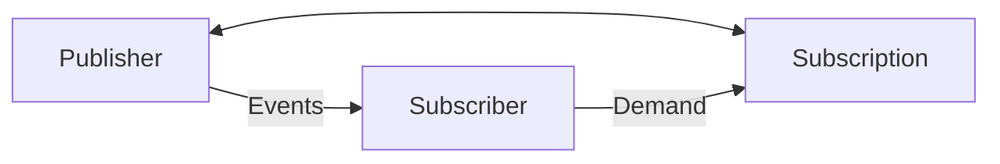

# Spring Reactive Programming

이 글은 아래 참고자료를 통해 배운 내용을 정리한 것입니다.  

> [참고자료]  
> [토비의 봄 TV 5회 스프링 리액티브 프로그래밍 (1) - Reactive Streams](https://www.youtube.com/watch?v=8fenTR3KOJo&list=PLOLeoJ50I1kkqC4FuEztT__3xKSfR2fpw&index=1)  
> [에디의 기술블로그 - Project Reactor 3. 리액티브 스트림](https://brunch.co.kr/@springboot/153)

## Iterable

Iterable는 for-each 구문을 사용하기 위해 구현해야하는 인터페이스입니다.
내부 구현을 보시면 Iterator 객체를 반환하는 iterator() 메서드를 구현하도록 되어있습니다.

```java
public interface Iterable<T> {
    
    Iterator<T> iterator();
    
    // ...
}
```

Iterator는 데이터를 순회하는 방법을 정의하는 인터페이스입니다.
내부 구현을 보시면 hasNext()와 next() 메서드를 구현하도록 되어있습니다.

hasNext()는 다음 요소가 있는지 확인하는 메서드이고, next()는 다음 요소를 반환하는 메서드입니다.

```java
public interface Iterator<E> {
    
    boolean hasNext();
    
    E next();
    
    // ...
}
```

예제로 구현한 spring.reactive.iterable의 MyIterable과 MyIterator는 Iterable과 Iterator를 구현한 클래스입니다.
코드를 보시면 정말 간단하게 구현할 수 있고, 사용할 때에도 for-each 구문을 사용하여 직관적으로 사용할 수 있습니다.

```java
void iteratorTest() {
    MyIterable iter = new MyIterable();
    for (int i : iter) {
        System.out.println(i);
    }
}
```

하지만 리액티브 프로그래밍에서는 Observable 패턴을 확장시킨 Reactive Streams를 사용합니다.

Observable 패턴은 Iterable과 비슷하지만, 데이터를 가져오는 방식에서 차이가 있습니다.

## Observable

다음으로 Observable 패턴을 사용해서 데이터를 가져오는 방식을 살펴보겠습니다.

> java 9 이후로 java.util.Observable와 java.util.Observer는 deprecated 되었지만, 예제를 위해 사용되었습니다.

Observable이란 데이터를 내보내는 객체입니다.
Observer는 Observable에서 데이터를 받아서 처리하게 됩니다.
이 때 Observer가 Observable의 데이터를 받도록 설정하는 것을 구독(subscribe)이라고 합니다.

먼저 Observable 인터페이스를 보시면 setChanged()와 notifyObservers(Object arg) 메서드가 구현되어 있습니다.

```java
public class Observable {
    private boolean changed = false;
    
    public void notifyObservers(Object arg) {
        Object[] arrLocal;

        synchronized (this) {
            if (!changed)
                return;
            arrLocal = obs.toArray();
            clearChanged(); // 다시 false로 만듭니다.
        }

        for (int i = arrLocal.length-1; i>=0; i--)
            ((Observer)arrLocal[i]).update(this, arg);
    }

    protected synchronized void setChanged() {
        changed = true; // 데이터가 변경되었음을 알립니다.
    }

    protected synchronized void clearChanged() {
        changed = false;
    }
}
```
setChanged()는 데이터가 변경되었음을 알리는 메서드이고, notifyObservers(Object arg)는 데이터를 Observer에게 전달하는 메서드입니다.
notifyObservers()는 clearChanged()를 호출하여 changed를 다시 false로 만듭니다.

```java
public class MyObservable extends Observable implements Runnable {

    @Override
    public void run() {
        for (int i = 1; i <= 10; i++) {
            setChanged();
            notifyObservers(i); // notifyObservers(Object arg)를 호출하여 데이터를 사용자에게 push합니다.
        }
    }
}
```

Observer 인터페이스는 update(Observable o, Object arg) 메서드를 구현하도록 되어있습니다.
update() 메서드는 Observable에서 push한 데이터를 받아서 처리하는 메서드입니다.

데이터를 가져오는 방식을 보면 Iterable은 iter.next()를 호출하여 데이터를 반환받지만,
Observable은 notifyObservers(Object arg)를 호출하여 데이터를 사용자에게 보냅니다.
Iterable은 pull 방식으로 데이터를 가져오지만, Observable은 push 방식으로 데이터를 받아서 사용하는 것입니다.

```java
void iteratorTest() {
    MyIterable iter = new MyIterable();
    for (int i : iter) {    // iter.next()를 호출하여 데이터를 반환받습니다.
        System.out.println(i);
    }
}
```

```java
void observableTest() {
    MyObservable observable = new MyObservable();
    MyObserver observer = new MyObserver();
    observable.addObserver(observer);
    observable.run();
}
```

Iterable은 사용자가 데이터를 가져오는 방식이고, Observable은 데이터를 사용자에게 보내는 방식입니다.  
즉, Iterable과 Observabl은 **쌍대성**(Duality)을 갖는다고 할 수 있습니다.

## Observable의 장단점

Observer 패턴은 데이터를 push하는 방식으로 데이터를 전달합니다.

[//]: # (즉, 데이터가 push되는 이벤트를  )

하지만 Observer 패턴은 다음과 같은 한계가 있습니다.

1. 작업이 완료되었다는 것을 알릴 수가 없다. (`onComplete`)
2. 에러가 발생했을 때, 에러를 처리를 유연하게 할 수 없다. (`onError`)

이를 해결하기 위한 표준으로 ReactiveX 혹은 Reactive Streams 등이 등장했습니다.
스프링에서는 Reactive Streams의 구현체로 Project Reactor를 사용합니다.

## Reactive Streams

Reactive Streams는 Observable과 동일하게 데이터를 push하는 방식으로 데이터를 전달합니다.

Observable과 다르게 Reactive Streams은 onError와 onComplete를 사용하여 에러와 완료를 처리합니다.

[//]: # (Backpressure&#40;배압&#41;란 데이터를 push하는 속도를 제어하는 것을 말합니다.)

[//]: # (이를 위해 Reactive Streams는 Subscription을 사용하여 데이터를 push하는 속도를 제어합니다.)

[//]: # (Subscription에서 request 메서드를 사용하여 데이터를 push하는 속도를 제어합니다.)

[//]: # ()
[//]: # (이 메서드는 구독자가 요청한 요소의 개수를 받아서 처리하는 메서드입니다.)

[//]: # (예를 들어, 구독자가 10개의 요소를 받고 싶다면 request&#40;10&#41;을 호출합니다.)

[//]: # (만약 구독자가 모든 요소를 받고 싶다면 request&#40;Long.MAX_VALUE&#41;를 호출합니다.)

[//]: # (만약 구독자가 요소를 받는 것을 멈추고 싶다면 cancel&#40;&#41;을 호출합니다.)

[//]: # (이를 통해 구독자는 요소를 받는 속도를 제어할 수 있으며, 이를 통해 백프레셔&#40;back pressure, 배압&#41;를 구현할 수 있습니다.)

[//]: # (배압이 없다면 발행자는 구독자가 처리할 수 없는 요소를 계속해서 발행할 수 있습니다.)

[//]: # (이는 구독자가 처리할 수 없는 요소가 발행되는 것을 방지하기 위해 사용됩니다.)

